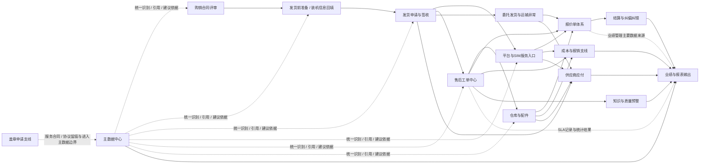

# BUSINESS_MAP_v0.2

> 目的：基于 CHAIN_01–26，重构项目背景层的业务模块地图。本文只回答“系统应按哪些业务模块理解、每个模块承接什么、不承接什么、上下游关系是什么”，不表达当前项目状态。

## 1. 模块划分原则
- 一个模块以“业务职责”划分，不以页面多少划分。
- 一个模块可以承接多个对象，但不应同时承担互相冲突的规则定义职责。
- “结果承接层”不重新定义“规则产生层”。
- 地图中的模块是项目背景模块，不等于最终菜单结构。

## 2. 业务模块总览

### M01 购销合同评审
- 对应链：CHAIN_01
- 作用：承接购销合同评审、成交约定、交付基础事实、平台 / SIM 条款事实、培训次数等。
- 上游：客户主体、销售成交事实。
- 下游：发货前准备、发货申请、培训相关约束、主数据引用。
- 不负责：服务补充合同 / 协议生命周期、报价结算、工单执行。

### M02 发货前准备 / 装机信息回填
- 对应链：CHAIN_02
- 作用：在发货前补齐机器号、平台、SIM 等必须信息，形成发货前可用的承接结果。
- 上游：购销合同评审通过结果。
- 下游：发货申请与签收、机器 / 平台 / SIM 主数据关系、后续收费与售后定位。
- 不负责：真实生产过程、发货执行、发货后收费规则重定义。

### M03 发货申请与签收
- 对应链：CHAIN_03
- 作用：承接一次合同可多次发货的交付过程，管理发货申请、提货票、回执单、签收与营企审核收口。
- 上游：合同评审、发货前准备。
- 下游：设备正式进入使用期、运输异常、主数据正式生效关系。
- 不负责：委托发货、运输异常处理、售后工单、供应商应付。

### M04 委托发货与运输异常
- 对应链：CHAIN_08、CHAIN_12
- 作用：承接正常发货之外的物流支线场景，包括公司内委托、客户委托、借用机、运输异常。
- 上游：交付链、客户委托、物流执行事实。
- 下游：报价单、工单、物流商应付、设备返回 / 转销售衔接。
- 不负责：正常合同交付主链、完整费用结算、工单主流程。

### M05 平台与SIM服务入口
- 对应链：CHAIN_04、CHAIN_05
- 作用：承接平台费 / SIM费的提醒、建议、免费口径、来源报价生成。
- 上游：合同条款、发货签收后生效关系、当前有效服务补充合同 / 协议建议依据。
- 下游：报价单体系、成本支线、供应商应付支线。
- 不负责：报价合并结算细则、平台商 / SIM卡商付款本身。

### M06 售后工单中心
- 对应链：CHAIN_06、CHAIN_26
- 作用：承接维修、培训、改造、检修 / 巡检四类工单，并形成统一内部处理主链；维修工单进一步产生 SLA 记录与统计。
- 上游：设备进入使用期、客户报修、销售或客服发起、运输异常转入。
- 下游：仓库与配件、报价单、故障知识库、批量不良预警、SLA统计、成本支线。
- 不负责：报价结算、绩效制度、主数据最终确认规则。

### M07 仓库与配件
- 对应链：CHAIN_07
- 作用：承接总仓 / 分仓库存动作、工单配件流、配件销售流、返还与异常库存处理。
- 上游：工单、报价单、BOM / 零部件主数据。
- 下游：配件发货、运输成本、快递商应付、成本支线。
- 不负责：关键零部件 SN 主数据换绑确认、报价结算、采购流程全文。

### M08 报价单体系
- 对应链：CHAIN_09
- 作用：承接所有对客收费需求，形成需求单、报价单、报价明细，并完成财务两次确认之间的业务收口。
- 上游：平台 / SIM 收费入口、收费工单、配件销售、客户委托运输、运输异常收费场景。
- 下游：对应业务执行链、结算层、服务经理业绩管理。
- 不负责：正常回款开票流程细节、退款退票纠错细节。

### M09 结算与纠偏纠错
- 对应链：CHAIN_10、CHAIN_11
- 作用：承接报价明细粒度的回款、到账确认、开票处理、合并结算，以及冲销、退款、退票等特殊流程。
- 上游：报价单体系。
- 下游：结算结果、报表输出、必要时回改原报价。
- 不负责：报价内容重定义、财务系统外的真实执行方式。

### M10 主数据中心
- 对应链：CHAIN_13、CHAIN_25、CHAIN_16
- 作用：承接客户、合同、机器、SIM、平台、BOM / 零部件、现场信息、关键件 SN 等基础对象；并明确服务补充合同 / 协议当前有效的引用边界。
- 上游：合同评审、发货前准备、发货签收、业务录入、盖章申请。
- 下游：交付、工单、收费、供应商应付、报表。
- 不负责：工单执行、报价结算、报表重新定义规则。

### M11 成本与报销支线
- 对应链：CHAIN_14、CHAIN_15
- 作用：承接预估成本、实际成本、出差申请、借款、驻外补助、报销与成本回写。
- 上游：工单执行、客户拜访、仓库与配件、平台 / SIM 使用结果。
- 下游：成本结果、毛利分析、报表输出。
- 不负责：财务总账、报销制度全文、间接成本全部展开。

### M12 盖章申请支线
- 对应链：CHAIN_16
- 作用：承接服务合同 / 协议、报价单及其他文件的盖章申请与历史留痕。
- 上游：服务合同 / 协议文本、报价单、其他文件。
- 下游：主数据承接或历史留痕。
- 不负责：判断文件生效、判断协议当前有效、改变报价主流程状态。

### M13 知识与质量预警
- 对应链：CHAIN_17、CHAIN_18
- 作用：基于工单沉淀故障知识、识别批量不良风险。
- 上游：工单事实、换件记录、机型与零部件主数据。
- 下游：客服关注、质量分析、专题报表。
- 不负责：工单主链、供应商责任认定、复杂 AI 方案。

### M14 供应商应付
- 对应链：CHAIN_19、CHAIN_20、CHAIN_21、CHAIN_22
- 作用：承接物流商、平台商、SIM卡商、快递商四类供应商的对账 / 账单 / 付款闭环。
- 上游：物流执行事实、平台月度明细、SIM月度明细、月付快递行为。
- 下游：付款记录、成本支线、报表输出。
- 不负责：客户侧收费、主业务执行链、统一成一个计费模型。

### M15 业绩与报表输出
- 对应链：CHAIN_23、CHAIN_24
- 作用：承接固定经营输出、专题输出、灵活分析，以及服务经理任务 / 预计 / 已完成 / 差额跟踪。
- 上游：报价结算、成本、工单、SLA、协议、供应商应付、知识与预警等结果。
- 下游：经营管理观察。
- 不负责：重定义协议当前有效规则、SLA规则、供应商应付规则、绩效扣罚制度。

## 3. 模块关系图

## 4. 模块边界总原则
- M10 主数据中心提供统一识别与引用边界，但不取代各业务链的执行过程。
- M12 盖章申请只负责申请与留痕，不能在地图中被理解为“生效中心”。
- M15 报表输出承接结果，不回头定义业务事实。
- M06 工单中心与 M13 知识 / 预警共享工单事实来源，但对象不同、目标不同。
- M08 报价单体系与 M09 结算层必须分层理解。
- M14 供应商应付与 M05 / M08 客户侧收费是不同方向的业务，不能合并为同一模块。

### 4.1 系统通用能力支撑层（引用）

- 身份、主体与访问控制能力，为各业务模块提供内部组织、内部人员、外部主体、外部联系人、账号、角色与权限底座。
- 系统治理与控制能力，为各业务模块提供数据字典、审计日志、历史版本与基础配置承接。
- 流程与交互配置能力，为多模块提供流程承接、表单承接、按钮动作与关键确认提醒框架。
- 数据处理与操作效率能力，为多模块提供统一列表、搜索过滤、批量导入导出与结构化录入效率能力。
- 文件、输出与通知能力，为多模块提供附件、打印、通知模板与站内消息承接能力。
- 开发与测试辅助能力，服务于系统验证与维护，不作为业务模块编号体系的一部分。
- 上述能力均为跨模块底座，统一以 `SYSTEM_CAPABILITIES_BACKGROUND.md` 为准，不在本文展开为独立业务模块。

## 5. 本文边界
- 不写当前有无页面。
- 不写“待实现 / 已存在 / 未来新增”这类项目状态。
- 不写按钮、字段、权限、实现方案。
- 只保留项目背景所需的模块职责、上下游关系与边界。
