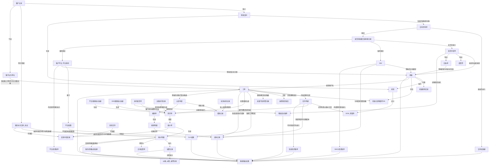
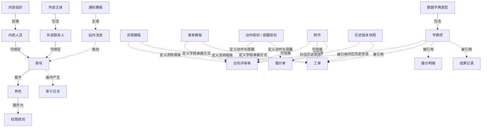

# OBJECT_MAP_v0.2

> 目的：基于 CHAIN_01–26，重构项目背景层的对象地图。本文只表达“系统里真正要管的对象、对象之间的关系、引用边界和结果去向”，不表达页面、表结构或项目当前状态。

## 1. 对象分层

### 1.1 基础主数据对象
- 客户主体
- 客户业务单位
- 购销合同
- 服务补充合同 / 协议
- 机型
- 机器
- 机器关键零部件 SN
- SIM
- 平台配置
- 客户平台 / 平台机构
- BOM / 零部件
- 机器现场信息（联系人 / 地址 / 点位）

### 1.2 业务单据与过程对象
- 合同评审单
- 发货前准备信息承接记录
- 发货申请单
- 提货票
- 回执单
- 委托发货单
- 运输异常记录
- 工单
- 配件流转记录 / 库存单据
- 需求单
- 报价单
- 报价明细
- 结算记录 / 合并结算单
- 纠偏 / 纠错 / 退票记录

### 1.3 支撑与管理对象
- 平台来源报价依据
- SIM来源报价依据
- 成本记录
- 出差申请
- 借款记录
- 驻外补助记录
- 报销单 / 报销明细
- 盖章申请记录
- 故障知识条目
- 批量不良预警记录
- 物流商对账单
- 平台商月账单
- SIM卡商月账单
- 快递商月账单
- SLA结果
- 服务经理业绩结果
- 报表输出结果

### 1.4 系统支撑对象
- 内部组织
- 内部人员
- 外部主体（客户 / 供应商 / 其他外部协作主体）
- 外部联系人
- 账号
- 角色
- 权限规则
- 数据字典类型 / 字典项
- 流程模板
- 表单模板
- 动作规则 / 提醒规则
- 审计日志
- 历史版本快照
- 附件
- 通知模板
- 站内消息

## 2. 对象关系图

## 2.1 系统支撑对象关系（轻关系）

## 3. 核心对象说明

### 3.1 合同相关对象
- 购销合同与服务补充合同 / 协议不是同一类对象。
- 购销合同承接成交与交付事实；服务补充合同 / 协议承接售后服务、平台 / SIM 服务与专项服务约定。
- 合同评审单是系统内部流转对象，不等于客户签署的合同原件。

### 3.2 设备、平台、SIM 相关对象
- 机器是发货、售后、平台、SIM、运输异常等链条的核心串联对象。
- 平台侧机器号不默认等同于我司机器号；平台机构 / 客户平台与机器通过业务关系承接。
- 用我司 SIM 时，ICCID 是核心识别口径；签收前为临时绑定，签收后才正式生效。

### 3.3 报价与结算对象
- 需求单用于承接收费需求；报价单与报价明细用于确定对客应收基础。
- 报价明细是后续结算最小处理单元。
- 纠偏 / 纠错 / 退票记录是结算层特殊流程对象，不与正常报价、正常结算混写。

### 3.4 仓库与配件对象
- 库存单据承接入库、出库、调拨、返还、盘点、异常库存处理等动作。
- 配件名称、图号、价格默认引用 BOM / 零部件主数据。
- 关键零部件旧 SN 核验、新 SN 更换事实可在工单中承接，但最终主数据绑定口径仍由关键件 SN 主数据承接。

### 3.5 成本与供应商应付对象
- 成本记录用于承接预估成本与实际成本，不等于报销、也不等于供应商应付账单。
- 物流商、平台商、SIM卡商、快递商四类供应商应付对象分别独立，不混为一个账单体系。
- 客户侧收费与供应商侧应付可来源于同一业务事实，但对象、金额口径和结算方向不同。

### 3.6 管理输出对象
- SLA结果只承接维修工单时效记录与统计，不直接等于绩效扣罚结果。
- 服务经理业绩结果主要基于报价单结果形成，不直接由 SLA 统计转化。
- 报表输出结果是统一承接层，不重新定义上游业务事实。

## 4. 关键边界
- 盖章申请记录不等于主数据，不等于当前有效协议，不等于报价单生效。
- 主数据不替代业务单据；业务单据也不替代主数据。
- 故障知识条目与批量不良预警记录都来源于工单，但一个偏知识沉淀，一个偏风险识别。
- 物流商应付、平台商应付、SIM卡商应付、快递商应付共享“应付账单”概念，但来源对象和计费逻辑不同。

## 5. 本文边界
- 不写数据库表结构。
- 不写字段清单。
- 不写页面入口和当前实现状态。
- 只保留项目背景所需的对象清单、对象关系与引用边界。
