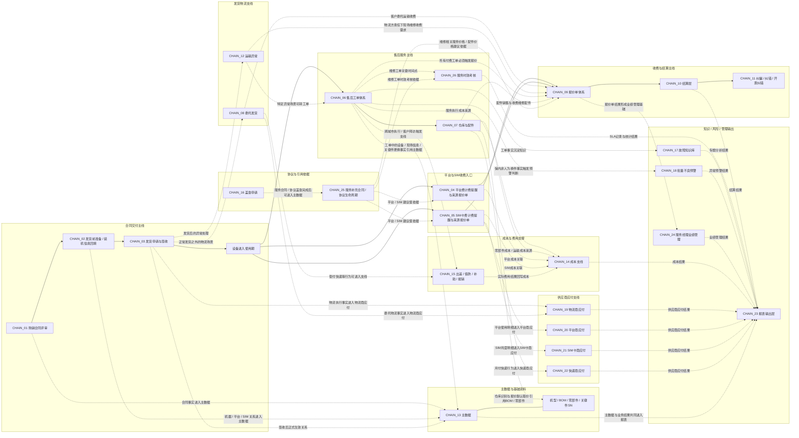

# PROCESS_MAP_v0.2

> 目的：基于 CHAIN_01–26，重构项目背景层的全局流程地图。本文只表达业务主线、支线、引用关系与结果去向，不表达项目现状、实现状态、页面细节或代码结构。

## 1. 使用规则
- 实线表示主流程或直接流转。
- 虚线表示引用依据、建议依据、考核依据、结果输出或支撑关系。
- 本图强调“业务关系”，不等于页面流转图，不等于状态机，不等于系统当前实现情况。
- 购销合同评审、服务补充合同 / 协议生命周期、工单执行、报价结算、供应商应付、报表输出是不同层级的链，不混写为同一条线。

## 2. 全局流程地图（主线 + 支线 + 结果层）

## 3. 主流程说明

### 3.1 合同交付主线
- 购销合同评审是交付主线起点，只承接购销合同，不承接服务补充合同 / 协议。
- 合同评审通过后进入发货前准备，补齐机器号、平台、SIM 等发货前必须具备的信息。
- 发货申请与签收链承接一次合同可多次发货的现实，签收后才形成正式生效关系。
- 设备进入使用期后，才会自然衔接平台 / SIM 收费提醒、售后工单与后续服务场景。

### 3.2 物流相关支线
- 委托发货是正常发货之外的物流支线，分为公司内委托与客户委托。
- 运输异常是发货主链的异常支线，按机器号处理，自动关联原发货、原合同、原货号和原物流公司。
- 客户委托运输可能触发对客收费；物流执行事实又可能进入物流商应付。

### 3.3 售后服务主线
- 售后工单中心不是只承接维修，还包括培训、改造、检修 / 巡检。
- 四类工单复用统一内部主链，但发起方式、前置审核、是否收费、是否多设备存在差异。
- 所有付费工单必须触发报价后才能派单；免费场景按各自业务规则走申请与审核。
- 仓库与配件是工单周边实物流转支链，不替代工单，也不替代关键件 SN 主数据确认。

### 3.4 收费与结算主线
- 平台费、SIM卡费、客户委托运输、收费维修、收费配件等收费需求，最终都汇入报价单体系。
- 报价单负责确定“该收什么钱”；结算层负责“钱怎么收、怎么开票”；纠偏 / 纠错 / 开票纠错属于结算层特殊流程。
- 普通报价单与合并结算底层规则一致，区别只在结算范围。

## 4. 关键引用关系
- 服务补充合同 / 协议生命周期负责判断“当前有效协议是谁”，不与购销合同评审混写。
- 当前有效协议可影响三类下游：平台 / SIM 建议值、维修相关服务价格 / 配件价格建议依据、维修工单时效考核依据。
- 盖章申请只负责申请与留痕，不等于进入主数据，不等于当前有效可引用。
- 主数据负责统一识别、引用、关系追溯与历史留痕，不替代业务单据。

## 5. 管理与输出层
- 成本支线承接报价阶段预估成本与业务执行后的实际成本。
- 出差 / 借款 / 补助 / 报销支线为服务执行成本、客户拜访成本、垫付费用等提供结果来源。
- 故障知识库与批量不良预警都来源于工单，但分别解决知识沉淀与风险识别，不替代工单主链。
- 服务经理业绩管理是独立经营管理支链，主要引用报价单结果，不直接引用 SLA 统计作为已完成判断依据。
- 报表输出层是结果承接层，不重新定义协议是否当前有效、不重新定义 SLA 规则、不重新定义供应商应付规则、不重新定义服务经理业绩规则。

## 6. 本文边界
- 不写页面、字段、权限、状态机和实现方式。
- 不写“哪些模块已上线 / 未上线 / 暂无页面”。
- 不写 repo 现状、缺口清单、开发建议。
- 只保留足以支持项目背景理解的主流程、支线、引用关系与结果去向。
